**University of Pennsylvania, CIS 565: GPU Programming and Architecture,
Project 4 - Scan Matching**

* Author : Kushagra
  * [LinkedIn](https://www.linkedin.com/in/kushagragoel/)
* Tested on : Windows 10, i7-9750H CPU @ 2.60GHz 16GB, GTX 1650 4GB (Personal Computer)

____________________________________________________________________________________

# Scan Matching

## What is Scan Matching?
Scan Matching is a classical Machine Perception Problem in which we want to find the transformation between 2 different pointclouds scans of the same object. It can be used by a robot to find its own location in the world by analysing its position with respect to the orientation of known objects in a known environment. We perform scan matching by an algorithm called the iterative closest point search algorithm. 
Let us start with the ever famous stanford bunny.
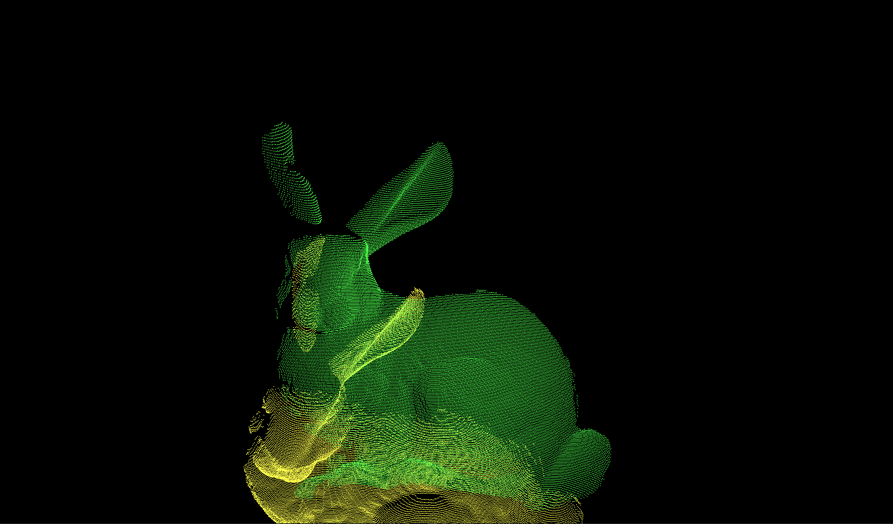

## Iterative Closest Point Search
Iterative Closest Point Search works by computing the correspondence between initial location and final location by naively considering the closest point in the final location for each point in the initial location. Then it computes the best approximation for the rotation and the translation matrix and transforms the initial position accordingly. It keeps repeating this until a stopping condition is encountered like a threshold or any other convergence criterion. Let us look the original Algorithm in its original glory.

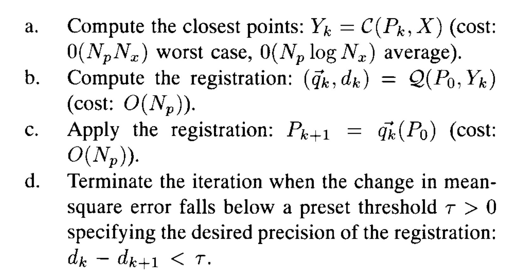

## The Algorithm
Let us see how the algorithm is actually implemented in a program. We are essentially trying to find the values of rotation and translation such that the following error is minimised.  
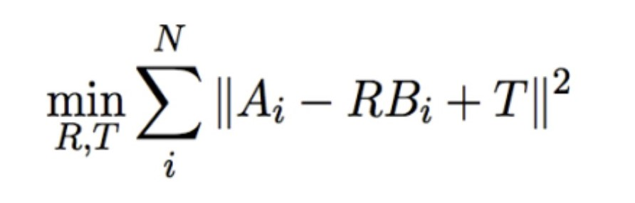  
Differentiating with respect to the translation, we can see that Translation is essentially the difference between the centroids. Rewriting the points as offset to centroids and the frobenius norm of the loss in terms of its trace, we get 
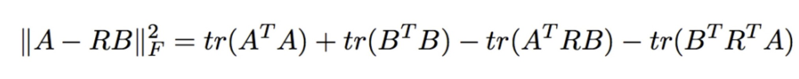  
Which is essentially reduces to  
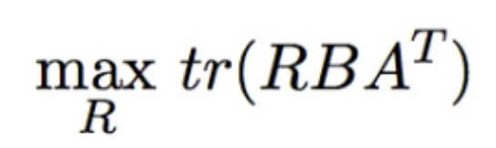

And with some final sprinkle of math magic, we get   
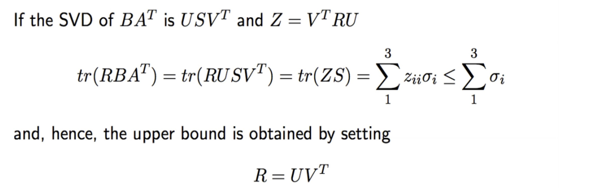

(Shh! just silently make sure the determinant is positive otherwise you'll be in huge trouble )

## Results  
*  Dragon  
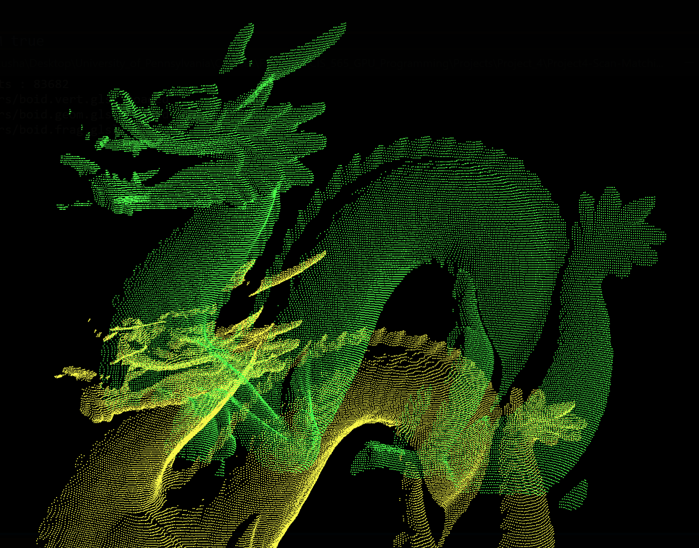  

*  Buddha  
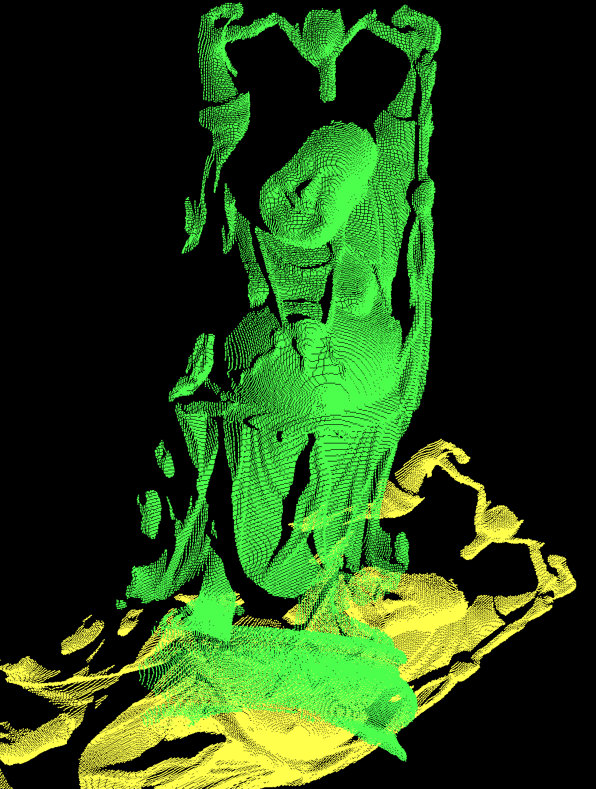  

*  Cube  
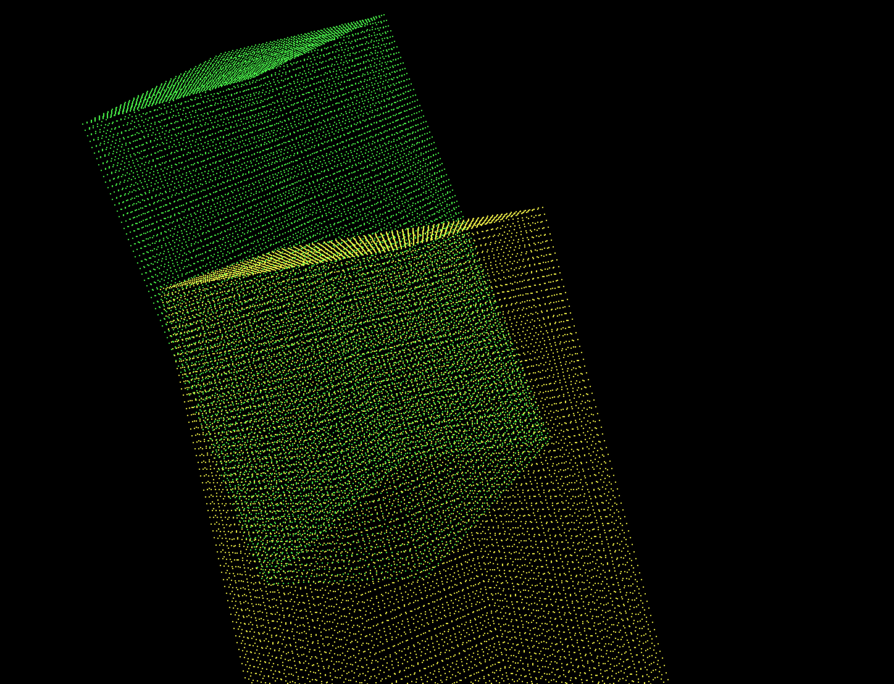  

*  Cylinder  
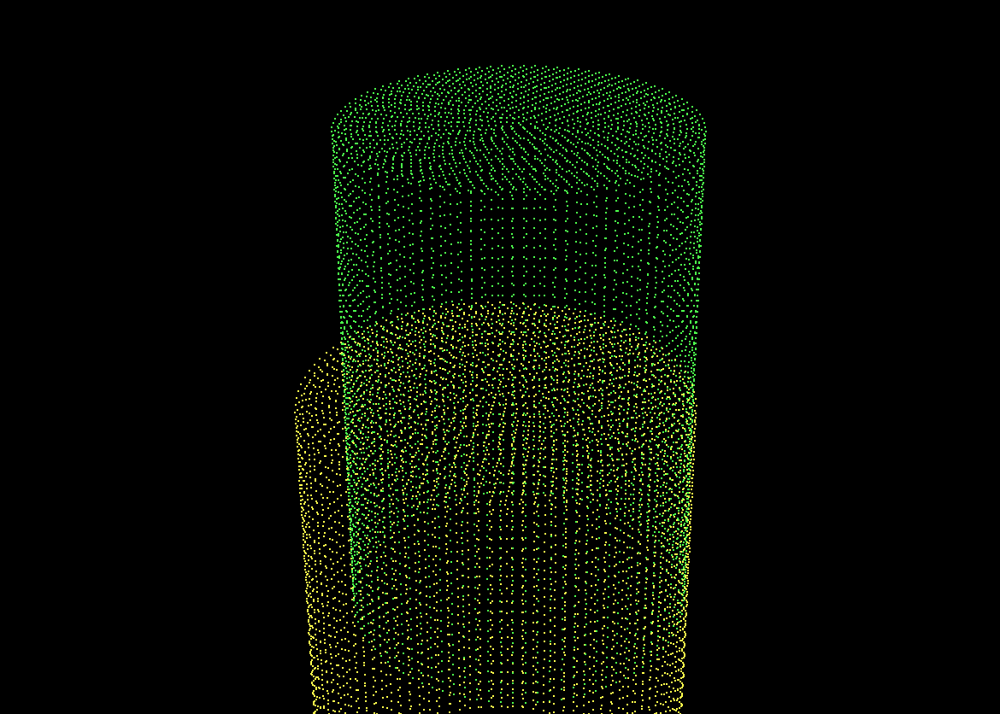  

## Implementation
### CPU Implementation
We implement the whole algorithm on the CPU, using highly optimized [svd3 library by Eric Jang](https://github.com/ericjang/svd3). Here are some statistics about how the CPU scores with number of points in the point cloud.

| Scene         | Number of Points  | Final FPS  | Average Time Taken |
| ------------- |:-----------------:| ----------:| ------------------:|
| Cylinder      | 11502             | 8.1        |          0.12 s    |
| Cube          | 28762             | 1.4        |          0.75 s    |
| Bunny         | 80512             | 0.3        |          6.06 s    |
| Dragon        | 83682             | 0.2        |          6.1 s     |
| Buddha        | 156112            | 0.0        |          20.68 s   |

### Naive GPU Implementation
We convert the CPU code to the  equivalent GPU code performing the bulk parallalizable operations on the GPU.

| Scene         | Number of Points  | Final FPS  | Average Time Taken |
| ------------- |:-----------------:| ----------:| ------------------:|
| Cylinder      | 11502             | 141.9      |          0.002 s   |
| Cube          | 28762             | 127.6      |          0.004 s   |
| Bunny         | 80512             | 37.9       |          0.023 s   |
| Dragon        | 83682             | 32.5       |          0.025 s   |
| Buddha        | 156112            | 11.7       |          0.082 s   |

### GPU Implementation with KD-Trees
We observe that the code takes long time to find the closest point correspondences as it is iterating over all the points in the scene, we can optimize this by using KD-Trees and pruning the points dynamically based on the closest point seen so far. Here is a rough idea of what data structure kd-trees creates and how the pruning works. 

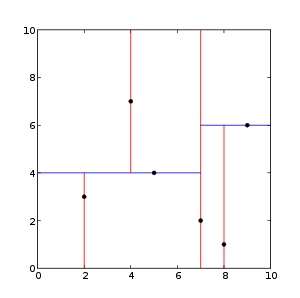 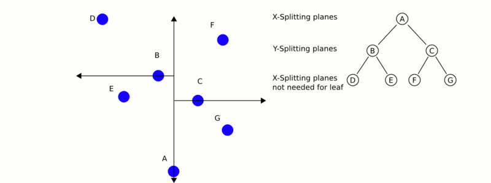

We see significant benefits of KD Tree when the number of points is high.  

| Scene         | Number of Points  | Final FPS  | Average Time Taken |
| ------------- |:-----------------:| ----------:| ------------------:|
| Cylinder      | 11502             | 145.8      |          5.5 s     |
| Cube          | 28762             | 146.3      |          2.5 s     |
| Bunny         | 80512             | 135.5      |          5.98 s    |
| Dragon        | 83682             | 134.5      |          7.1 s     | 
| Buddha        | 156112            | 80.2       |          3.58 s    | 

Bizarrely the time taken for KD-Tree is very high even though the frame rates are almost triple that of naive GPU. The speedup visible too. Not sure why this is happening.  
But according to our expectation, KD-Tree holds up really well when the number of points increase a lot. Which is evident from the chart below.  

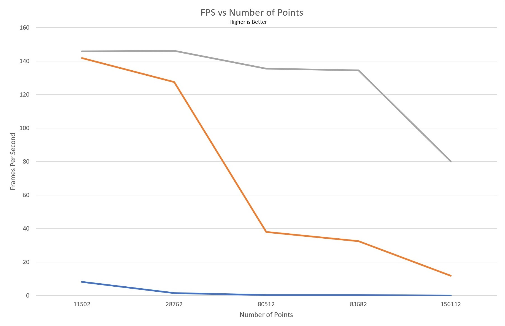
